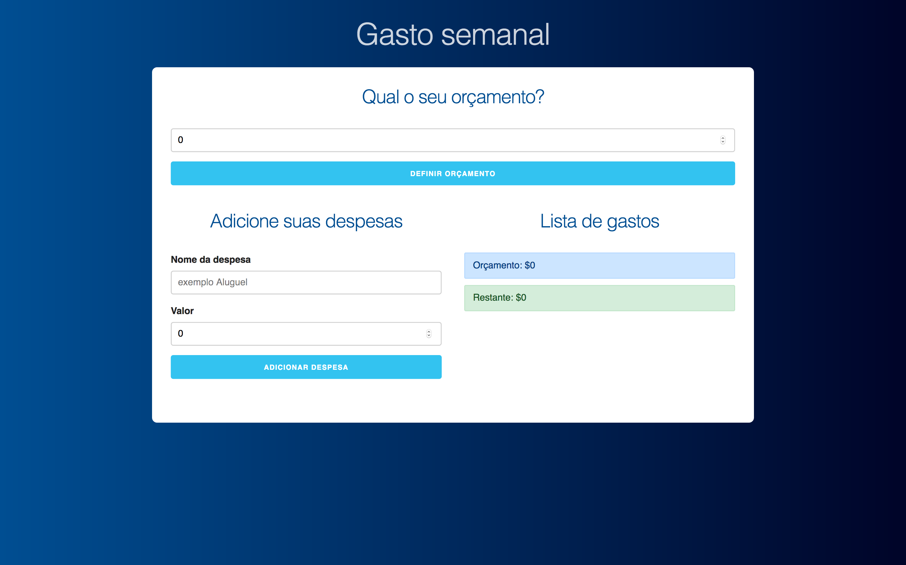
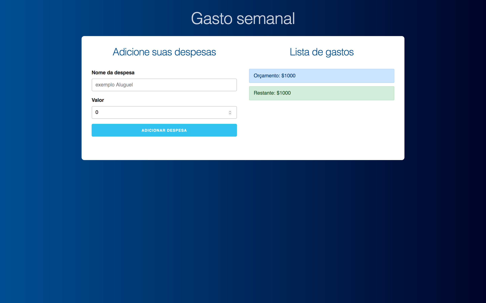
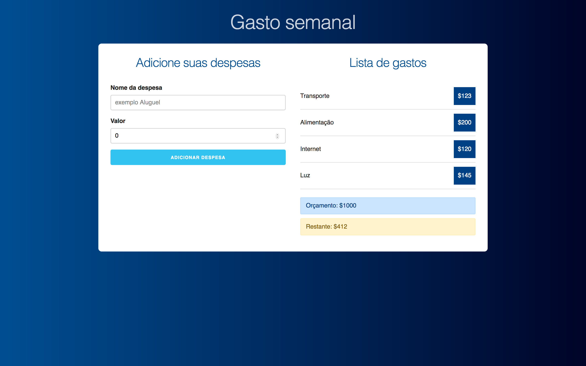

<h1 align="center">
  <a href="https://musing-shirley-07391e.netlify.app/">
    Controle de orçamento
  </a>
</h1>

    

    

    

## 🚀 Tecnologias

- React
- Create-react-app
- PropTypes
- CSS

## 🖥 Live
<a href="https://musing-shirley-07391e.netlify.app/">
  Controle de orçamento
</a>
